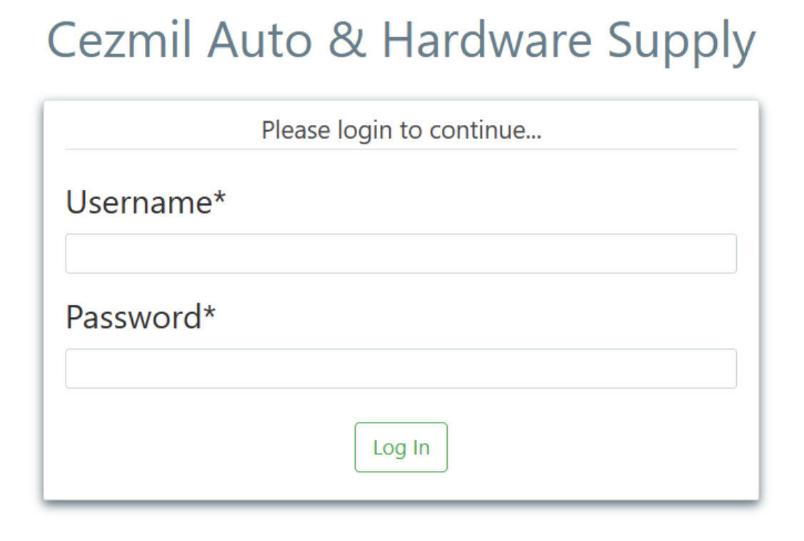
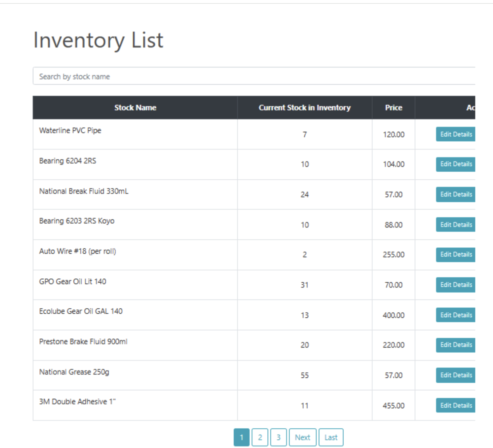

# Hardware Inventory Management System (HIMS)

A full-stack **Hardware Inventory Management System** (HIMS) integrated with a **Point-of-Sale (POS)** module and **data analytics dashboard**, built using Django and deployed via PythonAnywhere. Developed to streamline inventory control, sales tracking, and operational insights for small-to-medium hardware businesses.

## 📌 Features

- **🔐 Admin Login System**  
  Secure authentication system for authorized users.

- **📦 Inventory Management**  
  Add, update, or delete inventory items with real-time stock tracking.

- **🧾 POS and Billing System**  
  Seamlessly handle sales transactions and generate receipts.

- **📊 Data Analytics Dashboard**  
  Visualize stock trends and generate inventory insights using dynamic analytics.

- **📇 Supplier Management**  
  Manage and track supplier details and purchase histories.

- **📤 Data Exporting**  
  Export inventory, sales, and purchase data in CSV format.

## 💡 Tech Stack

| Tech        | Description                             |
|-------------|-----------------------------------------|
| **Backend** | Python, Django                          |
| **Frontend**| HTML, CSS, JavaScript                   |
| **Database**| SQLite                                  |
| **Deployment**| PythonAnywhere                        |

## 📌 Architecture Overview

- Modular Django structure with `models.py`, `views.py`, `urls.py`, and `settings.py`.
- Object-oriented design representing users, inventory, suppliers, and sales.
- Clean separation between business logic, database operations, and UI rendering.

## 📈 Development Methodology

Built using **Agile software development**, with iterative planning, stakeholder feedback sessions, and user-centric design. Key stages include:

1. **Requirements Gathering**  
   Collaboration with Cezmil Hardware Store to identify specific business needs.
2. **System Design**  
   Created a scalable and secure architecture blueprint.
3. **Development**  
   Feature implementation using Django and frontend tech.
4. **User Training**  
   Conducted walkthroughs and provided documentation.
5. **Deployment & Maintenance**  
   Deployed using PythonAnywhere with continuous improvement.

## 📷 Screenshots

### 🔐 Login Page

### 📦 Inventory Dashboard

## 👥 Authors

- Arvin Velarde — [@arvin_velarde@dlsu.edu.ph](mailto:arvin_velarde@dlsu.edu.ph)  
- Geoffrey Stamonica — [@geoffrey_stamonica@dlsu.edu.ph](mailto:geoffrey_stamonica@dlsu.edu.ph)  
- Luis Perez — [@luis_pereziv@dlsu.edu.ph](mailto:luis_pereziv@dlsu.edu.ph)  
- Vince Buenaventura — [@vince_buenaventura@dlsu.edu.ph](mailto:vince_buenaventura@dlsu.edu.ph)

## 🙏 Acknowledgments

Special thanks to our professors from **SOFDESG** and **LBYCPD2**, YouTube mentors, and our client, Cezmil Hardware Store, for their continuous support, feedback, and trust in the system’s development.

## 📚 References

For a detailed technical discussion and academic references, see our [IEEE-format Project Paper (PDF)](./HIMS_Group7_IEEEver.pdf).

---

> This project was developed as part of a university course requirement at De La Salle University.
